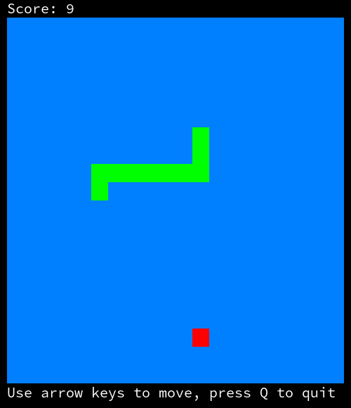

# cpp-snake
A text-based snake game

## Usage
Requires a Unix platform and a C++23 compiler.
```bash
git clone https://github.com/Eczbek/cpp-snake
cd cpp-snake
cmake -B build -S . -G Ninja
cmake --build build
./build/snake
```

&nbsp;


